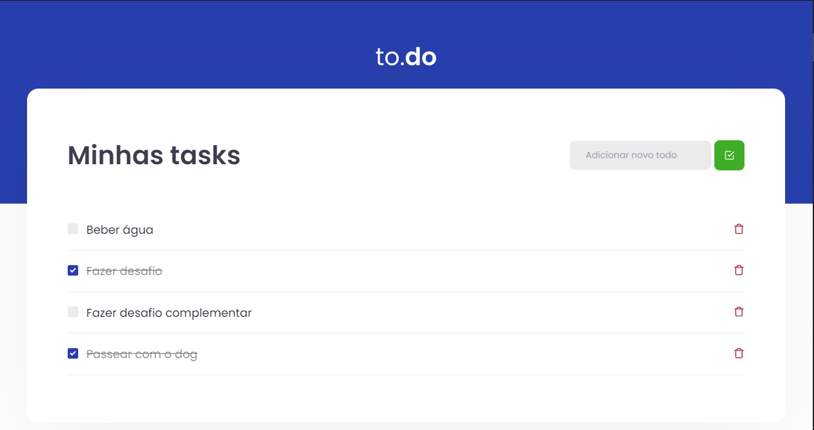

<p align="center">
  <a href="#-tecnologias">Tecnologias</a>&nbsp;&nbsp;&nbsp;&nbsp;|&nbsp;&nbsp;&nbsp;&nbsp;
  <a href="#-projeto">Projeto</a>&nbsp;&nbsp;&nbsp;&nbsp;|&nbsp;&nbsp;&nbsp;&nbsp;
  <a href="#-como-rodar">Como rodar</a>&nbsp;&nbsp;&nbsp;&nbsp;|&nbsp;&nbsp;&nbsp;&nbsp;
  <a href="#-testes">Testes</a>&nbsp;&nbsp;&nbsp;&nbsp;
</p>

<p align="center">
  
</p>

## 💻 Tecnologias

As tecnologias utilizadas foram:

- React
- TypeScript
- Sass

## 🚀 Projeto

O to.do foi um desafio realizado na trilha de ReactJs do Ignite, Bootcamp da Rocketseat.
O projeto consiste em uma aplicação de To Do list, que permite adionar, editar e remover tarefas.

## ⚙ Como rodar

### ⚙ Localmente
Clone o repositório com o comando:
``` bash
git clone https://github.com/alt-jams/Desafio01.git 
```
Entre no projeto:
``` bash
cd Desafio01
```
instale as dependencias com o comando:
``` bash
yarn
```
Inicie o projeto:
``` bash
yarn dev
```
A aplicação estará pronta no endereço http://localhost:8080

## 🧪 Testes

Os testes verificam:
- Deve ser possível adicionar uma tarefa;
- Não deve ser possível adicionar uma tarefa com título vazio;
- Deve ser possível remover uma tarefa;
- Deve ser possível marcar uma tarefa como concluída.

Rode os testes com o comando: 
``` bash
yarn test
```

<p align="center">
    💜
</p>
